# Ensino Médio: Amanda Segundo

*"Se eu programei até em papel, consigo programar em qualquer lugar."*

*Amanda Segundo*

## [A Escola Juscelino Kubitschek de Oliveira - JK](https://www.instagram.com/eetepa_jk/)

A escola está localizada na BR-316 no município de Marituba, próximo à divisa com o município de Benevides.

São ofertados cursos técnicos de Informática, Manutenção de computadores, Florestas, Agroindústria, dentre outros.

Trata-se de uma estrutura grande, arborizada e com um terreno extenso, a escola possui até uma grande capela pois já foi um lugar religioso.

A Escola JK merece reconhecimento e investimentos, seu trabalho social é muito importante para toda a região e ela gera excelentes profissionais.

Frente da escola JK (foto: Luiz Eduardo Macêdo)

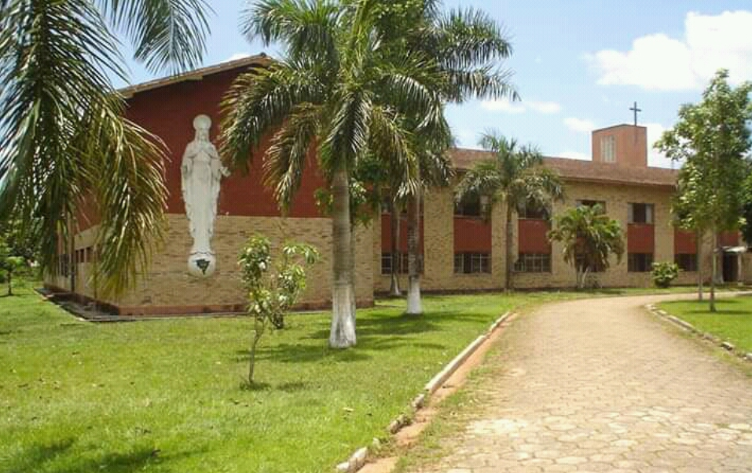

Frente da escola JK  por outro ângulo (foto: Brendo Felipe)

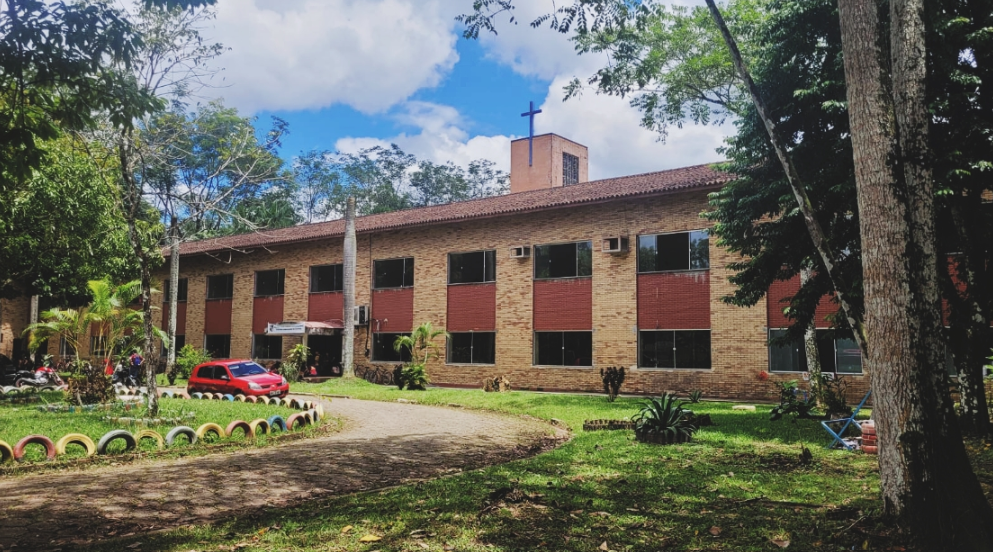

A capela (foto: Antonio Alves)

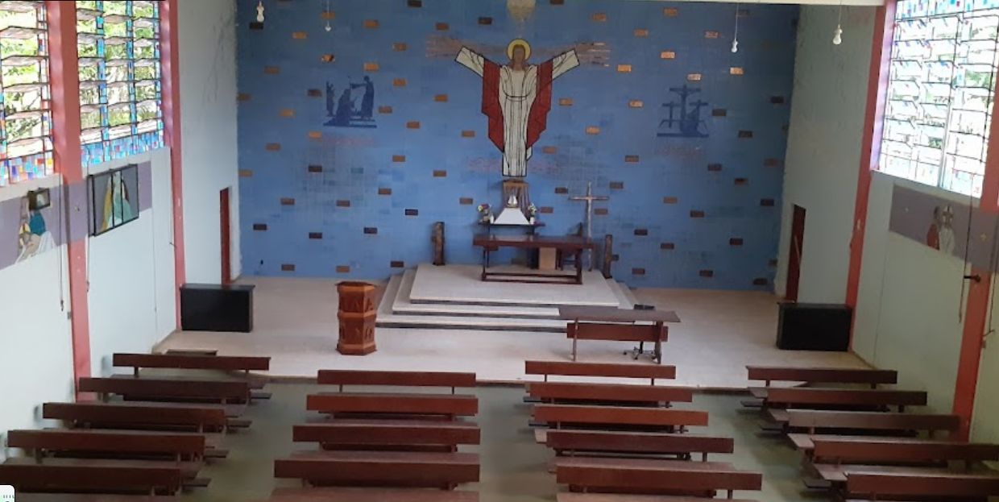

A capela (foto: Antonio Alves)

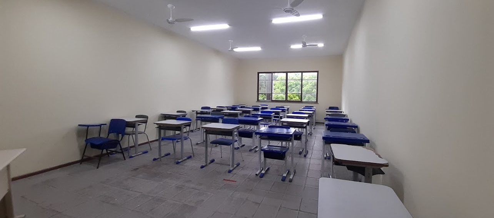

Eu na hora do intervalo (eu tinha o cabelo alisado e usava óculos 🤓😝)

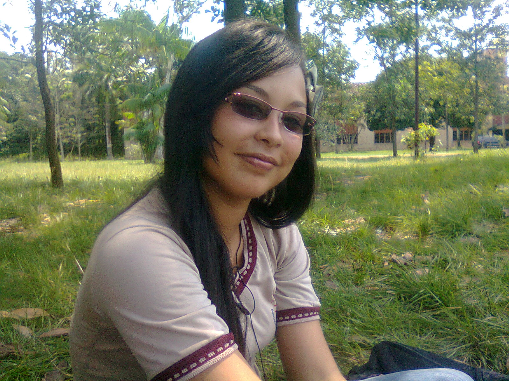

💡[Mais sobre a escola JK](https://www.google.com/maps/place/Escola+Estadual+Agroindustrial+Juscelino+Kubitscheck+de+Oliveira/@-1.3646688,-48.3029693,17z/data=!3m1!4b1!4m6!3m5!1s0x92a458a15daea677:0x56cb64e199c02000!8m2!3d-1.3646688!4d-48.3029693!16s%2Fg%2F11b6_dzw29?entry=ttu)

💡[Saiba quem foi a pessoa JK](https://pt.wikipedia.org/wiki/Juscelino_Kubitschek)

## Programar sem computador

Assim que eu entrei na escola, ela havia perdido seu laboratório de informática, então, infelizmente, as aulas de programação eram realizadas no papel, mas, isso não era um impedimento para estudar.

### Meu primeiro notebook

Dada a situação de que eu não tinha um notebook e estava programando no papel, meu tio Romeu Ribeiro, minha prima Samara e minha tia Vana me presentearam com um notebook usado.

Tio Romeu e família

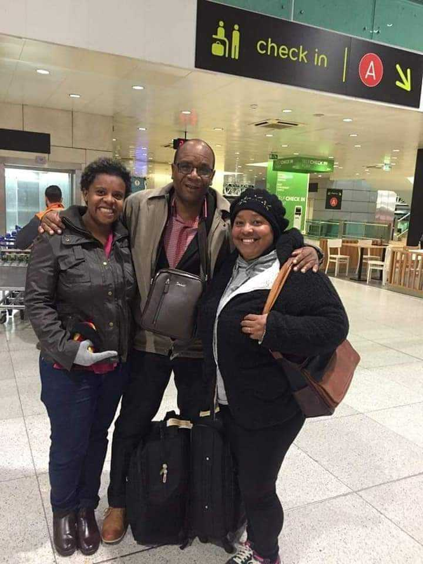

Foto real do meu primeiro notebook, era um Semp Toshiba

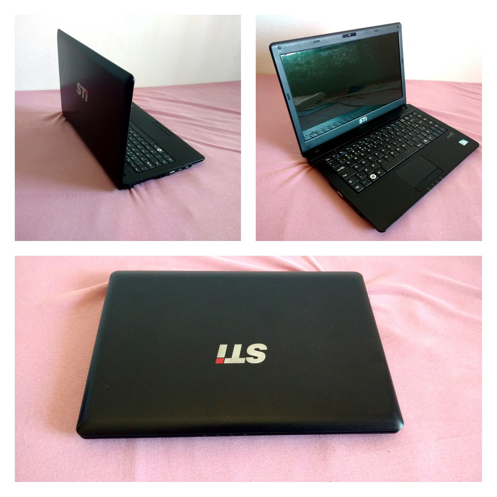

Na época meu tio trabalhava como professor em uma faculdade, hoje ele trabalha como [Administrador  no Ministério do Petróleo em Angola na África](https://www.facebook.com/mirempetangola/posts/897893974248266/) e também é auditor fiscal em uma empresa.

## Disciplinas interessantes

Além de Programação, eu gostava das disciplinas de Banco de Dados, Desenvolvimento Web, Redes e Microinformática.

### Aulas marcantes

#### História dos computadores

Ministrada pela professora [Marciane Lopes](https://www.instagram.com/marciane61/) essa aula foi muito marcante na minha vida, pois, conheci o ENIAC, o primeiro computador da história e conheci também a história por trás do primeiro algoritmo.

O [ENIAC](https://pt.wikipedia.org/wiki/ENIAC) foi testado e programado por mulheres, mas grande parte dos créditos não foram dados a elas:

A [Ada Lovelace](https://pt.wikipedia.org/wiki/Ada_Lovelace) foi a primeira pessoa a escrever um [algoritmo](https://pt.wikipedia.org/wiki/Algoritmo) a ser processado por um computador, considerada a primeira programadora da história:

#### Facebook

Lembro em uma aula que o professor [Antônio Marcos](https://www.instagram.com/amarcos26/) exibiu o filme [A Rede Social](https://pt.wikipedia.org/wiki/A_Rede_Social) para a turma. O filme conta a história do [Facebook](https://pt.wikipedia.org/wiki/Facebook) e de [Mark Zuckerberg](https://pt.wikipedia.org/wiki/Facebook).

Assim que eu entrei na escola, em 2010, já criei uma conta no Facebook, mas depois do filme eu fiquei fascinada por redes sociais:

## Amigos Nerds

### Elite

Minha turma era a Informática 2010 A e eu fazia parte do grupinho de nerds chamado Elite (nada modestos).

Esse grupo era formado por mim, Claudio Ferreira, Julio Gaia, Julio Silva e Vitor Moutinho, cada um seguiu com uma engenharia.

Reunião da Elite em 2024:

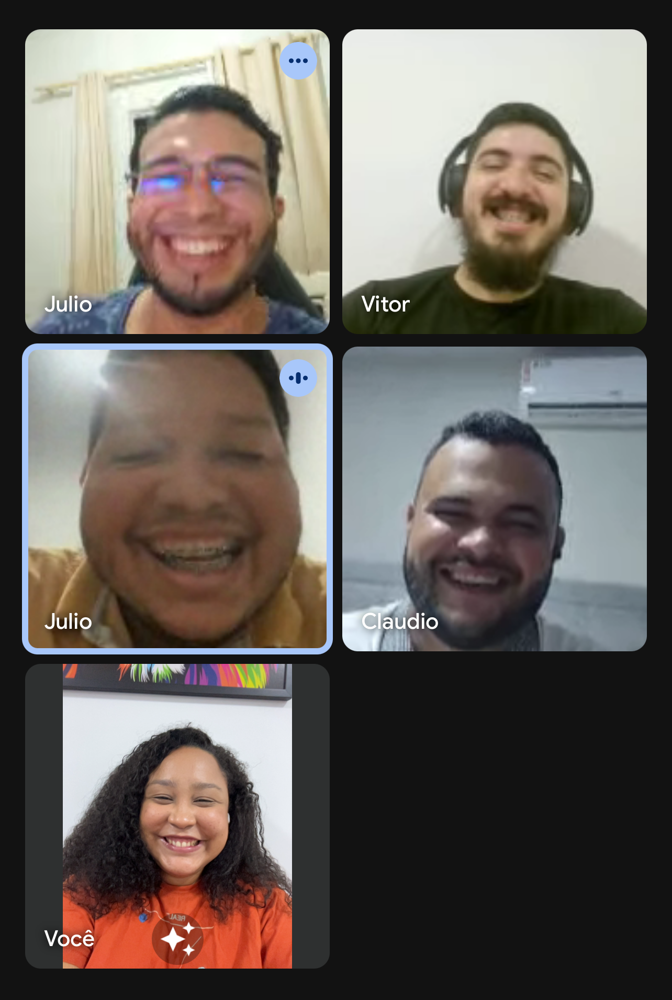

Elite na feira de ciências em 2012:

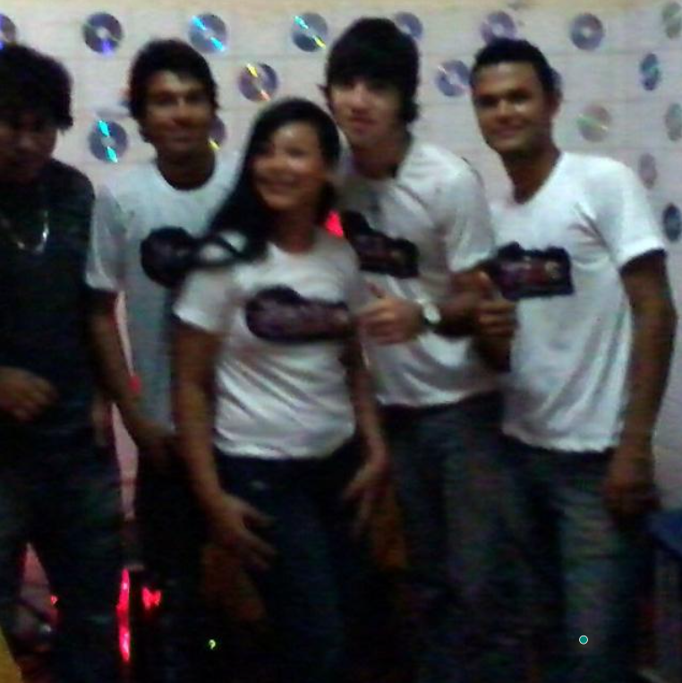

Logo da Elite:

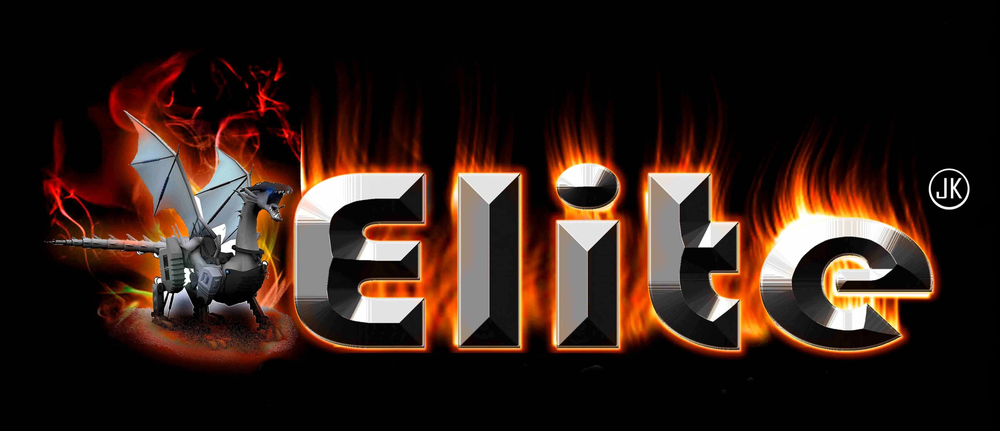

#### [Claudio Ferreira](https://www.instagram.com/claudio_ferreira2/) (Engenharia Elétrica Automobilística)]

O Cláudio gostava muito de mecânica e de jogar futebol. Ele era muito bem humorado e gostava de fazer piadas na sala, muito inteligente.

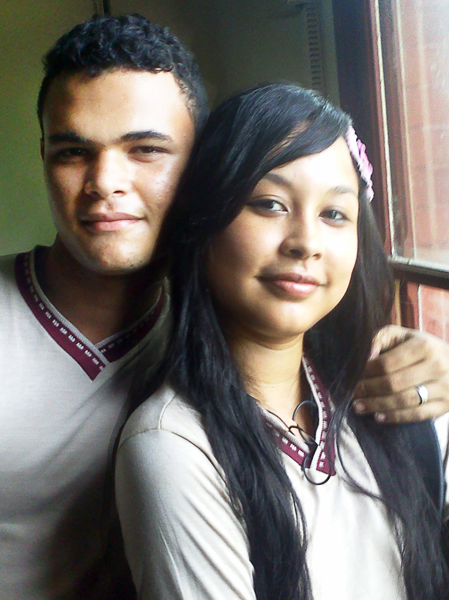

#### [Julio Gaia](https://www.linkedin.com/in/julio-pereira-gaia-ba024a137/) (Engenharia da Computação)

Ele gostava de física teórica, física experimental e astrofísica, e, era fã do Einstein.

A gente gostava de disputar quem tirava a nota mais alta em matemática e gostávamos de resolver problemas de lógica.

Foi por causa dele que eu conheci o Einstein e soube que ele era alemão, então eu pesquisei sobre a cultura alemã e gostei muito da forma que eles são organizados e planejados, foi por isso que eu tive a ideia de morar em Blumenau.

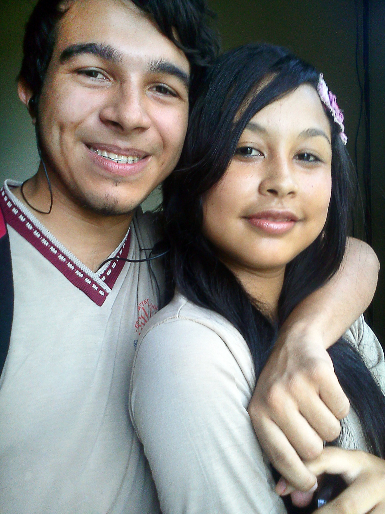

#### [Julio Silva](https://www.instagram.com/juliosilva_jss/) (Engenharia Ambiental)

O Julio gostava de formatar computadores e gostava de fazer manutenção de redes. Ele tinha um cyber e jogávamos Counter-Strike lá. Ele também gostava muito de música e tinha até um violão.

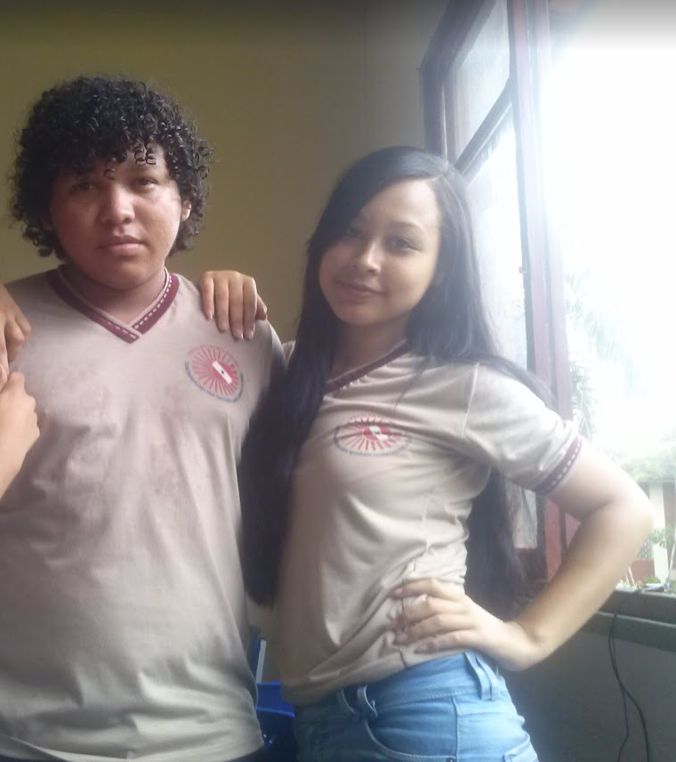

#### [Vitor Moutinho](https://www.linkedin.com/in/vitor-moutinho-1844ab146/) (Engenharia de Software)

O Vitor gostava de fazer manutenção de computadores, gostava de Redes e de programação, ele dizia que a hackear os sistemas e combater os [hackers](https://pt.wikipedia.org/wiki/Hacker), também gostava muito de redes sociais.

Um fato curioso é que a data de aniversário do Vitor é no dia 5 de outubro, mesma data do falecimento do [Steve Jobs](https://pt.wikipedia.org/wiki/Steve_Jobs), lembramos bem dessa data pois não tivemos ânimos para comemorar o aniversário dele em 2011.

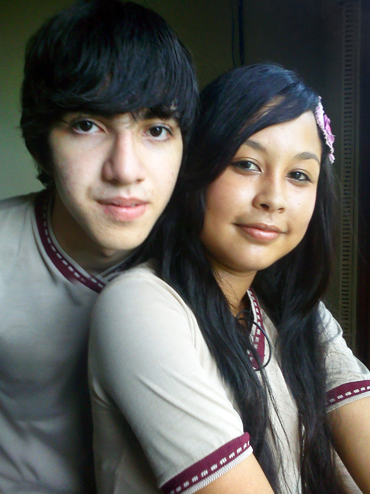

